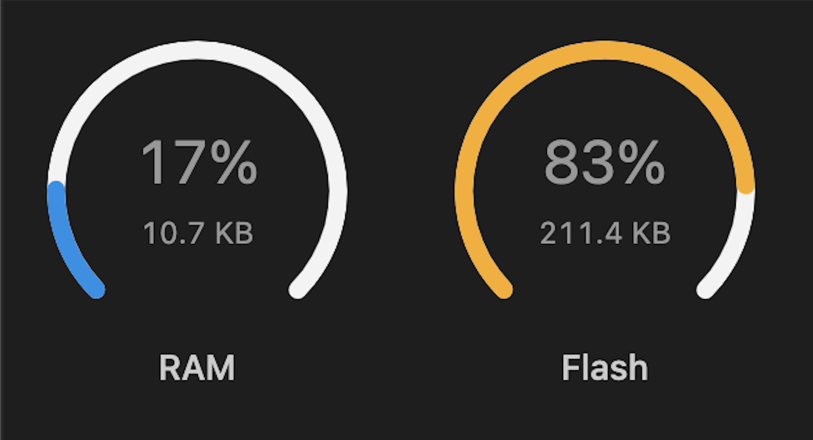

# ES-synth-starter

## Table of Content
[bin file for blasting the MCU](/report/firmware.bin)

[Functionality](#functionality)

[Tasks](#tasks)

[Execution Time](#execution-time)

[CPU Utilization](#cpu-utilization)

[Shared data structures and the methods](#shared-data-structures-and-the-methods)

[Dependencies]()

[Advanced Features](#advanced-features)

[Source code for funtioning](src/main.cpp)

[Test code for analysis](test/README)


## Functionality
### OLED

1. Staff and notes pressed
2. volume
3. octave
4. mode: receiver or sender
5. receiver displays the octave and the key pressed or released from the sender keyboard
### Keyboard
* multiple key press are played simultaneously
### Knob (0-3 from left to right)
* knob 0 unused
* knob 1 switches the setting of the MCU between receiver (master) or sender (slave)
* knob 2 changes the octave of the keys from 0-8 with default setting of 4
* knob 3 changes the volume of the sound output from 0-8 with default setting of 4
### receiver v.s. sender
* Keyboards are by default set to receiver mode in which it can work individually. Maximum of 2 can be connected together and manually change to a sender and a receiver using knob2
* when a keyboard is set to sender mode, it does not produce sound and volume will be set to 0, sound from all keyboards will be played from the receiver keyboard


## Tasks
> An identification of all the tasks that are performed by the system with their method of imple-mentation, thread or interrupt

| **Name**                                        | **Type**   |**Priority**| **Tick Rate (ms)**|
|-------------------------------------------------|------------|------------|---------------------|
| [sampleISR](#sampleisr)                         | Interrupt  | Highest    | N/A
| [CAN_RX_ISR](#can_rx_isr)                       | Interrupt  | Highest    | N/A
| [CAN_TX_ISR](#can_tx_isr)                       | Interrupt  | Highest    | N/A
| [scanKeyTask](#scankeytask)                     | Thread     | 4          | 20
| [decodeText](#decodeTask)                       | Thread     | 3          | 25.2
| [CAN_TX_Task](#can_tx_task)                     | Thread     | 2          | 60
| [displayUpdate](#displayUpdate)                 | Thread     | 1          | 100

### **SampleISR**
```
TIM_TypeDef *Instance = TIM1;
HardwareTimer *sampleTimer = new HardwareTimer(Instance);
sampleTimer->setOverflow(22000, HERTZ_FORMAT);
sampleTimer->attachInterrupt(sampleISR);
sampleTimer->resume();
```


This task processes the local keypress and octave information and the other MCU’s frequency information passed in through CAN which are represented in an array of phaseAcc, then produces a voltage output in the speaker making sound.

### **CAN_RX_ISR**
```
CAN_RegisterRX_ISR(CAN_RX_ISR);
```
This task receives message from the CAN bus and keeps it in a queue that stores data that waits to be processed by the decode thread.


### **CAN_TX_ISR**
```
CAN_RegisterTX_ISR(CAN_TX_ISR);
```
This task waits for data in a queue and gives the semaphore to the outgoing mailbox depending on the availability of the mailbox, sending the message to the CAN bus. 

### **scanKeysTask**
```
TaskHandle_t scanKeysHandle = NULL; // 20ms
xTaskCreate(
  scanKeysTask,     /* Function that implements the task */
  "scanKeys",       /* Text name for the task */
  64,               /* Stack size in words, not bytes */
  NULL,             /* Parameter passed into the task */
  4,                /* Task priority */
  &scanKeysHandle); /* Pointer to store the task handle */
```
This task scans through the key matrix to detect readings of the key presses then interpret the signals as notes and knob rotations. This information is stored into global volatile variables and used on the local MCU for master (receiver) or encoded into messages and placed in the CAN message queue for slave (sender).


### **decodeText**
```
TaskHandle_t decodeHandle = NULL; // 25ms
xTaskCreate(
  decodeText,     
  "decodeText",   
  256,            
  NULL,           
  3,              
  &decodeHandle); 
```
This task is only used on the receiver MCU as it receives and decodes the CAN message containing key and octave information into frequencies to produce the desired sound. This block will block and yield the CPU to other tasks until a message is available in the queue by using xQueueReceive().

### **CAN_TX_Task**
```
TaskHandle_t CAN_TXHandle = NULL;//60ms
xTaskCreate(
  CAN_TX_Task,     
  "CAN_TX_Task",      
  64,               
  NULL,             
  2,                
  &CAN_TXHandle);
```
This task is only used on the sender MCU as it takes a message from the CAN message queue and takes the semaphore before sending the message.

### **displayUpdateTask**
```
TaskHandle_t displayHandle = NULL; // 100ms
xTaskCreate(
  displayUpdateTask,   
  "displayupdatetask", 
  256,                 
  NULL,                
  1,                   
  &displayHandle); 
```
This task controls the OLED display, presenting the volume, octave, note pressed in letter and on a staff, whether the MCU acts as a receiver or sender, and the receiver displays the keypresses from sender keyboards.

### Explanation:
The tasks set to threads are dependent on key and knob related variables updated in scanKeysTask and need to be blocked for changes in these global variables. Dependencies on the hardware pin reading and refresh leads to the design choice of conducting these tasks at different fixed execution rates that are multiples of the RTOS tick rate. They do not use high sample rates to keep the CPU utilization low. This is handled by a scheduler in the setup function to manage the switching between tasks to allow waiting and continuing of tasks in an infinite loop.

SampleISR is implemented as an interrupt as it generates sound output which has to respond to the key inputs quickly. It requires the highest priority and the function calls are simplified to allow short execution so other tasks would not be blocked.  CAN_TX_ISR and CAN_RX_ISR are defined in the similar way as the time when the mailbox becomes available and when the message is delivered are random. To ensure sending is implemented as soon as the mailbox is available and picking up every message in time, interrupts are used to handle these short and immediate tasks.

## Execution Time

  | **Task**| **Initiation Interval (ms)&tau;<sub>i</sub>**   |**ExecutionTime (ms)&T;<sub>i</sub>**| **Iteration**| **$\frac {Exe}{Iter}$(ms)**|  **RMS Priority**|  **$\frac{\tau_n}{\tau_i}$**|  **Latency(ms)**|
|-------------|------------|---------------------|---------------------|---------------------|---------------------|---------------------|---------------------|
|scanKeys|20|3.76|32|0.1175|4|5|0.5875
|displayupdate|100|866.653|32|27.08291|1|1|27.0829063
|decodeText|25.2|1.365|32|0.042656|3|4|0.170625
|CAN_TX_Task|60|0.041|3|0.013667|2|2|0.02733333
|sampleISR|0.045|0.034|3|0.011333||2223|25.194
|RX_ISR|0.7|0.044|32|0.001375||143|0.196625
|TX_ISR|0.7|0.044|32|0.001375||143|0.196625
|||||||Total:|53.4556146

## Critical Instant Analysis

From the RMS diagram, the tasks with the shorter initiation interval are allocated to have higher priority, and they are scheduled to execute based on their priorities. The L_n is donated as the latency of the lowest-priority task at the worst-case instant in time.

Considering the algorithmic complexity, the scanKeysTask takes a bit longer execution time than expected but reasonable, because several ‘for’ loops are iterated and knob detection functions are called three times to make sure all change in the input can be captured sensibly. The execution time of displayupdateTask is relevant to the display content, the text and the graphics functions elaborate the data processing.DecodeText is fast because it like a dictionary which just copy the local received message into global variable then copied into another three local variables.CAN_TX_Task is fast because it just take a message from the CAN message queue. Furthermore, although the sampleISR is triggered at a frequent basis with shortest execution time, since it contains a ‘for’ loop featuring 24 iteration, and  arrays of 24 elements and of  13 elements, which increases the computing complexity significantly, thus occupies 25.19% CPU utilization. The CAN_RX_ISR and CAN_TX_ISR always appear as a pair, giving same measurement value. 

The total time required for the task to complete under worst-case conditions is calculated as  L<sub>n</sub> = $\sum_{i}$[$\frac{\tau_n}{\tau_i}$]$T_{i} \leqslant \tau_{n}$, which is obviously smaller than the deadline for the displayupdateTask, 100ms. The CIA verification is proved to pass. 


## CPU Utilization

  | **Task**| **Initiation Interval (ms)&tau;<sub>i</sub>**   |**ExecutionTime (ms)&tau;<sub>i</sub>**| **Iteration**| **CPU Utilisation(%)**|
|-------------|------------|---------------------|---------------------|---------------------|
|scanKeys|20|3.76|32|0.5875
|displayupdate|100|866.653|32|27.08290625
|decodeText|25.2|1.365|32|0.169270833
|CAN_TX_Task|60|0.041|3|0.022777778
|sampleISR|0.045|0.034|3|25.18518519
|RX_ISR|0.7|0.044|32|0.196428571
|TX_ISR|0.7|0.044|32|0.196428571
||||Total:|53.44049719

From the calculation $\sum_{i}$[$\frac{T_i}{\tau_i}$], the 53.44% CPU utilization gives better responsiveness to give more quick response to new requests and reduces power consumption. It also provides room for further development to perform more advanced functions. 




##  Shared data structures and the methods
## finArray
* Structure: `volatile uint8_t finArray[12];`
* Method: Mutex
* finArray contains 12 bits to indicate which key is pressed, so that we can play multiple keys at once.
* To enable multiple tasks to access a variable, finarray is defined as a global volatile variable. 
* By using a mutex to control access to finarray, the scankey and display task threads can access it concurrently without the risk of data corruption or inconsistency.
* Then the finArray is used in the sampleISR to convert to stepsizes. But finArray is not using mutex in the sampleISR because it is an interrupt.

## Send_finArray
* Structure: `uint8_t send_finArray[12]={1,1,1,1,1,1,1,1,1,1,1,1};` 
* Method: Mutex
* The send_finArray is identical to the finArray except for the fact that it is utilised in the decodeText thread to safeguard the finArray of sender, and is subsequently employed in the sampleISR. It is initialised to all 1's(non-active) to avoid making noises when there is no sender connected(elements are 0 without initiation which is unwanted active low).

## Knob Rotation values
* Structure: class that returns `int32_t` result
* Method: Mutex, atomic
* The knob is constructed in a class to make the code more efficient. And with a 32 bits integer, the operation can be completed with a single memory access.
* Knob rotation value is protected in the same mutex as keyarray because they are accessed at the same time. The mutex is used because the knob rotation value will be accessed in scantask and display task. 
* To prevent concurrency-related problems and data corruption, the knob value is stored atomically, ensuring that no other thread accesses or modifies the memory location during the operation.

## Send message
* Structure: local `uint8_t send_TX_Message[8] = {0};`
* Method: Queue, Mutex and Semaphore 
* The send message is a local variable because it is only used in scankey task.
* Messages are lined up for sending and the queue facilitates the sending of messages by multiple threads as the process of adding a message to the queue is thread-safe. 
* To prevent the transmit thread from continuously checking the hardware, a semaphore will be used by the transmit thread to determine when a message can be placed in the outgoing mailbox. An Interrupt Service Routine is set up to signal the semaphore every time a mailbox becomes free.
* The STM32 CAN hardware contains three mailbox slots for outgoing messages, and the semaphore is used to control access to this resource. Since three messages can be loaded at the same time, a counting semaphore can be utilized.

## Receive message
* Structure: global `uint8_t RX_Message[8] = {0};`
* Method: Queue, Mutex
* Each CAN frame takes less than 1ms to transmit and the hardware can only buffer three messages at a time. Therefore, many messages could be missed before the poll statement is reached. By using a queue to store incoming messages, it is possible to ensure that all messages are received and processed, even if the system is unable to handle them immediately. This helps to prevent the loss of important messages and ensures that the system remains responsive and reliable.
* To reduce the chance of deadlock, the decode thread protects the received message by placing a copy in a local message and then copying it to the global message after acquiring the mutex. This approach ensures that the original message is shielded from modification or deletion by other threads during processing, which minimizes the likelihood of a deadlock occurring due to multiple threads attempting to access and change the same resource simultaneously.

## Master
* Structure: `volatile bool master = false;`
* The "Master" is a boolean operator that enables the switching between the sender and receiver. Its initial value is false, which allows the boards to play sound independently.
* The detectknob1rot()function within the knob class retrieves a knob value that is restricted to a range of 0 to 1, and subsequently modifies the Master variable as necessary.
* Even though the Master variable is global, it is not safeguarded by the mutex since it is accessed by multiple threads at the same time.

## Dependencies


The dependency graph clearly shows that most of the threads have directed, cyclic dependencies, which does not have the likelihood of deadlocks. However, there is a cycle when it comes to CAN_TX because a semaphore is utilised to signal when a message can be accepted. The semaphore is given by an ISR when space is available in the outgoing mailbox and taken by the CAN_TX_Task before loading a message. The thread won't be scheduled by the RTOS if the semaphore is unavailable. Since no other tasks are dependent on the sending of the message, there is no risk of dependency.


## Advanced Features
### Multikey press 
Multiple notes can be simultaneously played when the mode is set to receiver.  If two keyboards are connected and set to sender and receiver pair, all sounds are played from the receiver speaker, achieving chords functionality.

This is implemented in the task `SampleISR` with global variables `finArray` and `send_finArray`, which store the 12 bit active-low representation of key presses from the local keyboard and the sender keyboard respectively. An array, `phaseAcc` of size 24 holds the output frequencies of each key separately and is initialised to all 0's. `send_finArray` is decoded from the CAN message if a sender is connected or it is initialised to all 0's for inactive states. These two arrays are iterated through in a for-loop and when a key is pressed, the corresponding element in `phaseAcc` is changed to the output frequencies with a sawtooth calculated from the array index (indicating which key) and the octave. All `phaseAcc` elements are added together to produce the output signal, generating sounds of different pitches.

### Staff Display
All keys pressed are displayed on the local LED graphically on the staff and as a note letter directly beneath. 

This is implemented similarly to multikey press (chords) as the `finArray` it is iterated through element-wise and passed into a `drawNote` function where the array index is used as a key to map to circle position on u8g2 and name of the key. Due to fast iterations, the notes are displayed simultaneously as they are pressed.